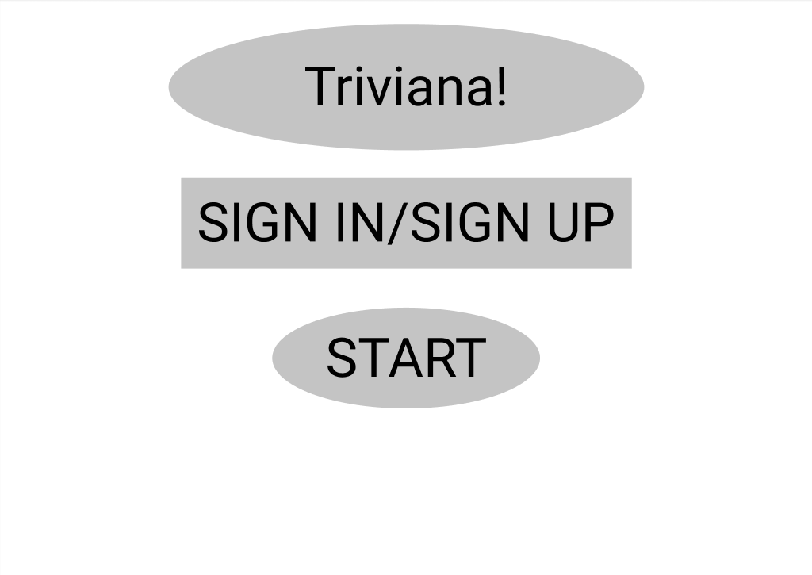
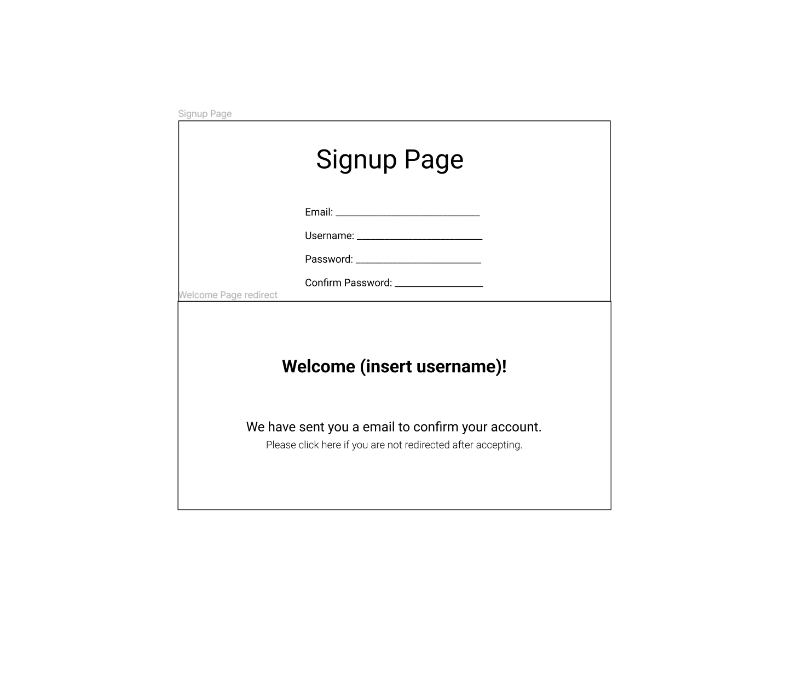
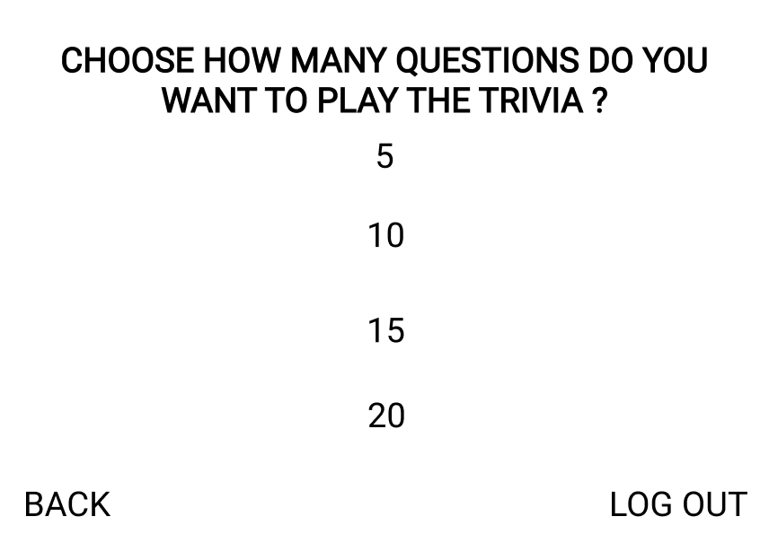
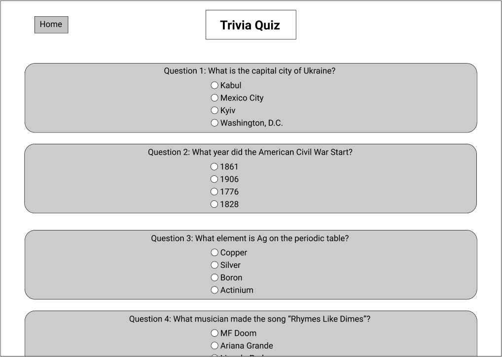
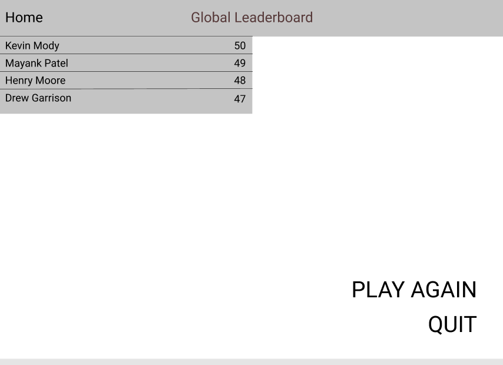

# Triviana!

## Description:

Triviana is a timed, multiple-choice trivia game. It generates a chosen number of random questions using a trivia API and populates fake answers using Wikidata. The user's time and correct answer total are logged to be shared on a leaderboard. The user can also create an account in order to keep track of their quiz statistics.

## Feature: 

- Leaderboard: This feature is a global leaderboard where users are ranked based on their performance in Trivia game.
- Buzzed out: This feature will create a sound effect if the user ran out of time to answer the question or got it wrong.
- Pics: This feature will give the user a picture for some specific questions and they will answer accordingly.
- Questionnaires: This feature will give users to set how many questions of a single trivia game they want to play
- Soundtrack: This feature will have background music in the game and music for each question that a user answers correctly. 

## Roadmap:
- [ ] Create web server
- [ ] Create database for results logging
- [ ] Implement question generation
- [ ] Implement quiz generation
- [ ] Implement account creation
- [ ] Create graphics for the UI
- [ ] Create game UI
- [ ] Create leaderboard UI
- [ ] Implement soundtrack for application

## Resources:
- Possible APIs to use
 1. https://github.com/linnndachen/Trivia-API
 2. https://opentdb.com/
 3. https://www.wikidata.org
- Possible languages to use
 1. HTML/CSS
 2. JavaScript
 3. React
 4. SQL

## Contributing:

Contributions are what make the open source community such an amazing place to learn, inspire, and create. Any contributions you make are greatly appreciated.

If you have a suggestion that would make this better, please fork the repo and create a pull request. You can also simply open an issue with the tag "enhancement". Don't forget to give the project a star! Thanks again!

1. Fork the Project
2. Create your Feature Branch (git checkout -b feature/AmazingFeature)
3. Commit your Changes (git commit -m 'Add some AmazingFeature')
4. Push to the Branch (git push origin feature/AmazingFeature)
5. Open a Pull Request

## Authors and acknowledgment:

1. Mayank Dineshkumar Patel - mayankdp - mdpatel@g.clemson.edu
2. Kevin Mody (Scrum Master) - kevinmody - kmody@g.clemson.edu
3. Henry Moore - henrymooresc - hpmoore@g.clemson.edu
4. Drew Garrison - awgarri - awgarri@g.clemson.edu

## Teamwork Policies:

- Communicate with the group through Microsoft Teams
- All the tasks assigned by a Scrum Master or team member needs to be completed before the deadline. 
- Scrum Master is using Github Project tool to keep track and monitor all the backlogs, user stories and tasks. 

## UI Wireframes

- Basic home page

<!-- -->

- Home page while signed in

<!--  -->

- Account signup page

<!--  -->

- Quiz configuration page

<!--  -->

- Quiz page

<!--  -->

- Leaderboard page

<!--  -->

## License:

Distributed under the MIT License. See License.txt for more information.

